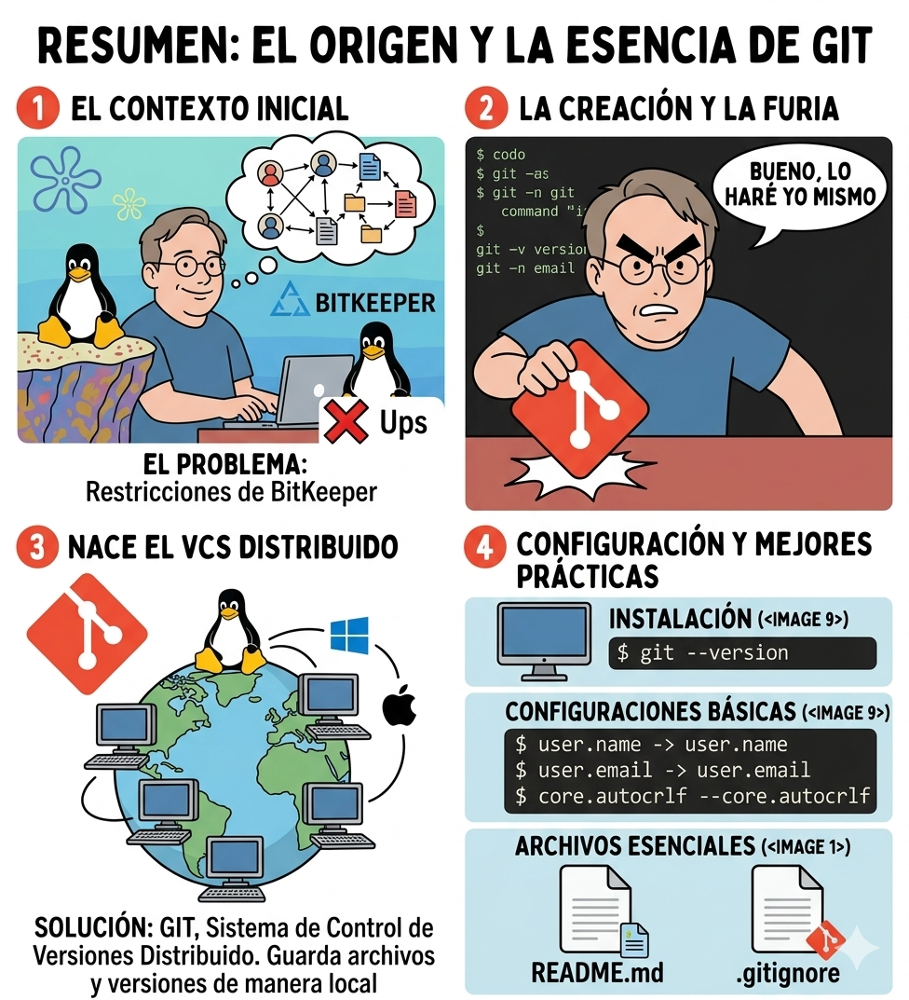
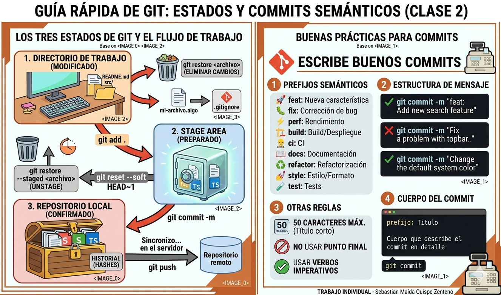
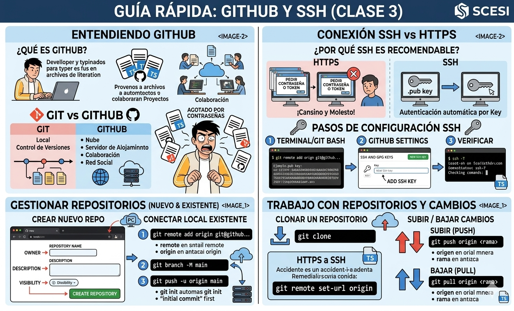
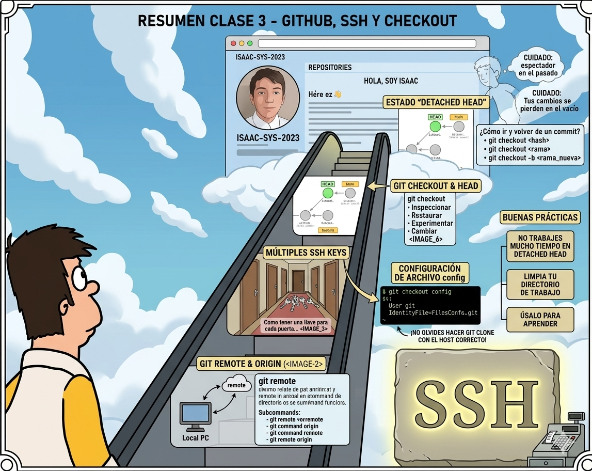
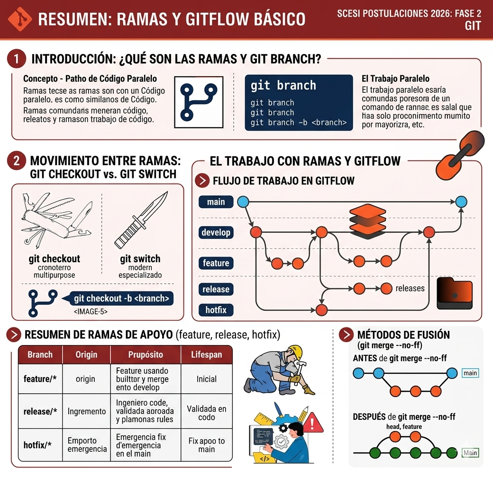
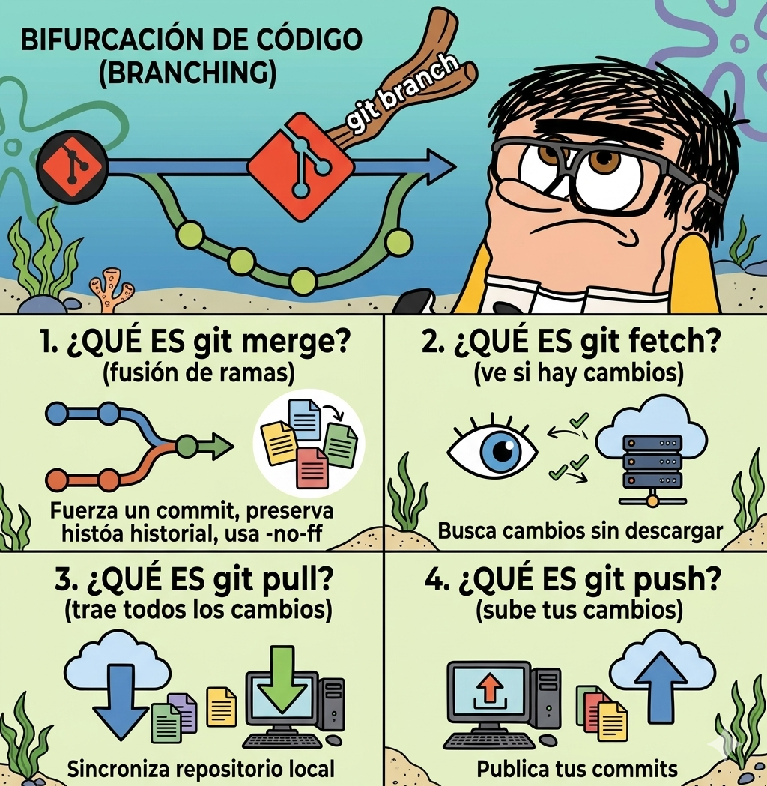
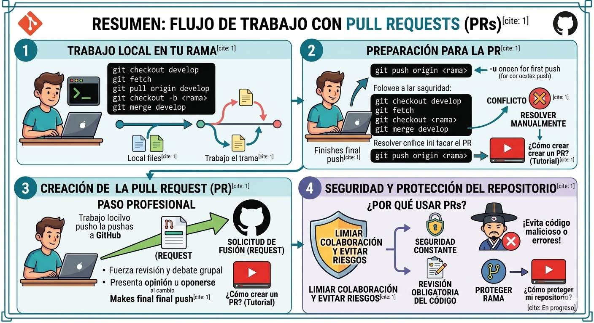
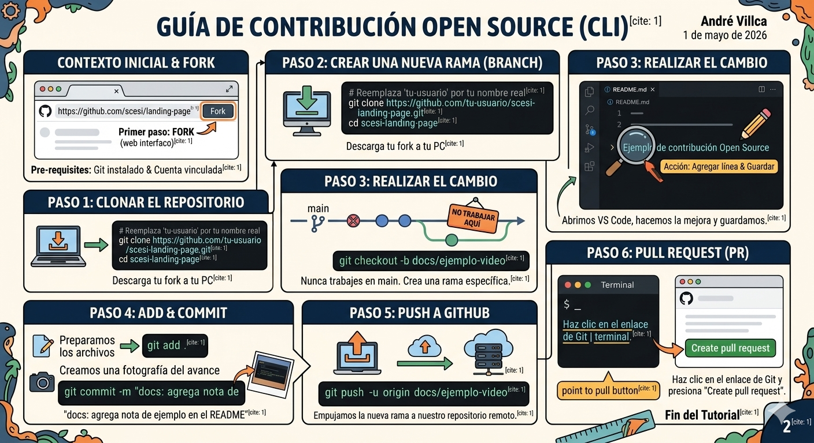

# Resumen Visual de Git - SCESI 2026

Este es mi repositorio de apuntes visuales para el curso de Git. Aquí registro todo lo aprendido, desde los conceptos básicos hasta el flujo de trabajo profesional.

## Clase 1: Introducción y Configuración Inicial

**El inicio de todo. Aprendimos qué es un sistema de control de versiones y configuramos nuestra identidad global con `git config`.**

## Clase 2: Estados y Commits Semánticos

**Entendimos el ciclo de vida de un archivo (Working Directory -> Staging Area -> Local Repo) y la importancia de usar commits que expliquen el "qué" y el "por qué".**

## Clase 3: GitHub y Autenticación SSH

**Conectamos nuestra PC con la nube. Generamos llaves SSH para que la comunicación sea segura y automática sin pedir contraseñas a cada rato.**

## Clase 4: Viajes en el Tiempo (Checkout)

**Aprendimos que con Git puedes volver al pasado. Usamos los hashes de los commits para revisar versiones anteriores de nuestro código.**

## Clase 5: Estrategias de Ramas (Gitflow)

**No todo se hace en `main`. Creamos ramas `feature/` para trabajar tranquilos sin romper el código que ya funciona.**

## Clase 6: Fusiones y Conflictos (Merge)

**El momento de la verdad: unir el trabajo. Aprendimos a usar `--no-ff` para mantener un historial limpio y a no tenerle miedo a los conflictos de código.**

## Clase 7: Flujo Profesional con Pull Requests (PRs)

**La forma en la que trabajan las empresas. Antes de unir código, pedimos una revisión (PR) para asegurar que todo esté perfecto y evitar errores.**

## Clase 8: Contribución Open Source y Fork

**Aprendimos a colaborar en proyectos de otros. Hicimos un Fork, trabajamos en nuestra propia copia y enviamos nuestras mejoras al proyecto original.**

